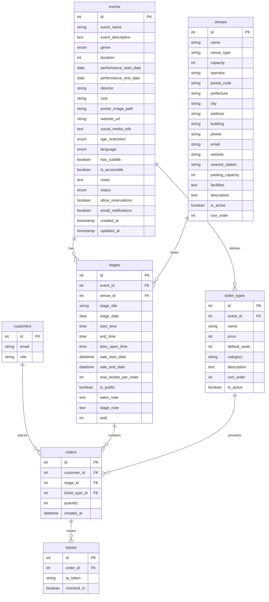

# DB テーブル定義一覧 (MVP)

| テーブル | 主キー | 主なカラム | 説明 |
| ---- | --- | ----- | -- |
|      |     |       |    |

| **customers**     | `id` (int) | `email` (string, unique)`role` (enum: systemAdmin / organizer / staff / checker / customer)                                                                | ログインユーザ。観客含む。    |
| ----------------- | ---------- | ---------------------------------------------------------------------------------------------------------------------------------------------------------- | ---------------- |
| **events**        | `id` (int) | `event_name` (string, not null)`event_description` (text, not null)`genre` (enum)`duration` (int)`performance_start_date` (date)`performance_end_date` (date)`director` (string)`cast` (string)`poster_image_path` (string)`website_url` (string)`social_media_info` (text)`age_restriction` (enum)`language` (enum)`has_subtitle` (boolean)`is_accessible` (boolean)`notes` (text)`status` (enum)`allow_reservations` (boolean)`email_notifications` (boolean)`created_at` (timestamp)`updated_at` (timestamp) | 公演情報。基本情報から設定までを含む。 |
| **venues**        | `id` (int) | `name` (string, not null)`venue_type` (string)`capacity` (int, not null)`operator` (string)`postal_code` (string)`prefecture` (string)`city` (string)`address` (string)`building` (string)`phone` (string)`email` (string)`website` (string)`nearest_station` (string)`parking_capacity` (int)`facilities` (text)`description` (text)`is_active` (boolean, default true)`sort_order` (int, default 0) | 会場情報。住所、連絡先、施設情報などを管理。 |
| **stages**  | `id` (int) | `event_id` (fk -> events.id)`venue_id` (fk -> venues.id)`stage_title` (string)`stage_date` (date, not null)`start_time` (time, not null)`end_time` (time)`door_open_time` (time)`sale_start_date` (datetime, not null)`sale_end_date` (datetime, not null)`max_tickets_per_order` (int, default 4)`is_public` (boolean, default true)`sales_note` (text)`stage_note` (text)`sold` (int, default 0) | ステージ。日時、販売設定、販売済数などを保持。 |
| **ticket\_types** | `id` (int) | `event_id` (fk -> events.id)`name` (string, not null)`price` (int, not null)`default_seats` (int)`category` (string)`description` (text)`sort_order` (int, default 0)`is_active` (boolean, default true) | 公演に紐づく券種。価格、デフォルト席数、カテゴリ、表示順、状態などを管理。 |
| **orders**        | `id` (int) | `customer_id` (fk -> customers.id)`stage_id` (fk -> stages.id)`ticket_type_id` (fk -> ticket\_types.id)`quantity` (int)`created_at` (datetime) | 購入（予約）単位。        |
| **tickets**       | `id` (int) | `order_id` (fk -> orders.id)`qr_token` (string, unique)`checked_in` (boolean, default false)                                                               | 1 枚のチケット。QR を保持。 |

## カラム型と制約のポイント

* すべての ID は `INT` ＋ AUTO\_INCREMENT (PostgreSQL: `SERIAL`、SQLite: `INTEGER PRIMARY KEY`).
* `qr_token` は UUIDv4 を 36 文字で格納し、一意制約。
* `role` はアプリケーション側の列挙型でバリデーション (DB は `VARCHAR`).
* `sold` カウンタは注文確定トランザクション内でインクリメントし、行ロックで競合を防止。

### events テーブル詳細仕様

* `genre`: 'drama', 'musical', 'concert', 'dance', 'comedy', 'other'
* `duration`: 1-600 (分)、NOT NULL
* `performance_start_date`, `performance_end_date`: 上演期間、NOT NULL
* `age_restriction`: '', 'R15', 'R18', 'PG12' (空文字列=制限なし)
* `language`: 'ja', 'en', 'ko', 'zh', 'other' (デフォルト: 'ja')
* `status`: 'draft', 'active', 'archived' (デフォルト: 'draft')
* `allow_reservations`, `email_notifications`: boolean (デフォルト: true)
* `poster_image_path`: ファイルストレージのパスを格納
* 制約: `performance_end_date >= performance_start_date`

---

## ER 図 (Mermaid)

---

> **備考**
>
> * 最小構成のため、会員詳細情報や決済情報のテーブルは未実装。
> * 決済機能追加時は `payments` テーブルを追加し、`orders` と 1:1 リレーションで紐付け予定。
